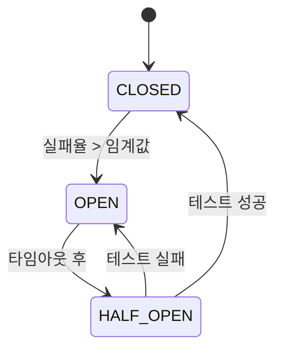

# Circuit Breaker 패턴 완전 가이드

## 목차
1. [Circuit Breaker란?](#circuit-breaker란)
2. [핵심 개념](#핵심-개념)
3. [Kotlin 구현](#kotlin-구현)
4. [Java 구현](#java-구현)
5. [실제 적용 예제](#실제-적용-예제)
6. [성능 최적화](#성능-최적화)
7. [모니터링 및 운영](#모니터링-및-운영)
8. [문제 해결](#문제-해결)

## Circuit Breaker란?

Circuit Breaker는 **마이크로서비스 아키텍처에서 장애 전파를 방지**하는 핵심 패턴입니다. 전기 회로의 차단기에서 영감을 얻어, 외부 서비스 호출 시 연속적인 실패가 감지되면 자동으로 호출을 차단하여 시스템을 보호합니다.

### 🔌 Circuit Breaker의 필요성

```
일반적인 호출 체인:
Service A → Service B → Service C → Database

Service C가 장애 시 발생하는 문제:
- Service B에서 타임아웃 대기
- Service A에서도 연쇄적으로 타임아웃
- 전체 시스템 리소스 고갈
- 사용자 경험 악화

Circuit Breaker 적용 후:
Service A → Service B → [Circuit Breaker] ⚡ Service C
                           ↓
                      빠른 실패 응답
```

### 🎯 주요 이점

1. **빠른 실패**: 장애 서비스 호출을 즉시 차단하여 응답 시간 단축
2. **리소스 보호**: 불필요한 네트워크 호출 및 스레드 사용 방지
3. **자동 복구**: 서비스 복구 시 자동으로 호출 재개
4. **장애 격리**: 한 서비스의 장애가 전체 시스템에 전파되는 것 방지

## 핵심 개념

### Circuit Breaker 상태



#### 1. CLOSED (정상 상태)
- **동작**: 모든 호출을 정상적으로 전달
- **모니터링**: 성공/실패율을 지속적으로 추적
- **전환 조건**: 실패율이 설정된 임계값을 초과하면 OPEN으로 전환

```kotlin
// CLOSED 상태 예시
val result = circuitBreaker.execute {
    externalService.call() // 정상 호출
}
```

#### 2. OPEN (차단 상태)
- **동작**: 모든 호출을 즉시 차단하고 예외 발생
- **목적**: 장애 서비스에 대한 추가 부하 방지
- **전환 조건**: 설정된 시간(Open Timeout) 경과 후 HALF_OPEN으로 전환

```kotlin
// OPEN 상태 예시
try {
    val result = circuitBreaker.execute {
        externalService.call() // 즉시 차단됨
    }
} catch (e: CircuitBreakerOpenException) {
    // 빠른 실패 처리
    return fallbackResponse()
}
```

#### 3. HALF_OPEN (반개방 상태)
- **동작**: 제한된 수의 테스트 호출만 허용
- **목적**: 서비스 복구 여부 확인
- **전환 조건**: 
  - 테스트 성공 시 → CLOSED
  - 테스트 실패 시 → OPEN

```kotlin
// HALF_OPEN 상태 예시
// 처음 몇 개의 호출만 실제로 실행
val result = circuitBreaker.execute {
    externalService.call() // 제한적 호출
}
```

### 주요 설정 매개변수

| 매개변수 | 설명 | 일반적 값 | 영향 |
|---------|------|-----------|------|
| **failureRateThreshold** | 실패율 임계값 | 50-70% | 민감도 조절 |
| **minimumNumberOfCalls** | 최소 호출 수 | 10-20회 | 잘못된 차단 방지 |
| **openTimeout** | OPEN 상태 지속 시간 | 30-60초 | 복구 시도 빈도 |
| **halfOpenMaxCalls** | Half-Open 테스트 호출 수 | 3-10회 | 복구 확인 정확도 |
| **callTimeout** | 개별 호출 타임아웃 | 1-10초 | 응답성 vs 안정성 |

## Kotlin 구현

### 기본 Circuit Breaker 클래스

```kotlin
class CircuitBreaker(
    private val name: String,
    private val config: CircuitBreakerConfig = CircuitBreakerConfig()
) {
    private val state = AtomicReference(CircuitBreakerState.CLOSED)
    private val metrics = CircuitBreakerMetrics()
    private val halfOpenTestCalls = AtomicInteger(0)
    private val lastStateChangeTime = AtomicLong(System.currentTimeMillis())
    
    suspend fun <T> execute(operation: suspend () -> T): T {
        val currentState = getCurrentState()
        
        return when (currentState) {
            CircuitBreakerState.CLOSED -> executeInClosedState(operation)
            CircuitBreakerState.OPEN -> handleOpenState()
            CircuitBreakerState.HALF_OPEN -> executeInHalfOpenState(operation)
        }
    }
    
    private suspend fun <T> executeInClosedState(operation: suspend () -> T): T {
        return try {
            val result = withTimeout(config.callTimeout.toMillis()) {
                operation()
            }
            metrics.recordSuccess()
            result
        } catch (e: TimeoutCancellationException) {
            metrics.recordTimeout()
            checkIfShouldOpenCircuit()
            throw CircuitBreakerException("Operation timed out", e)
        } catch (e: Exception) {
            metrics.recordFailure()
            checkIfShouldOpenCircuit()
            throw CircuitBreakerException("Operation failed", e)
        }
    }
    
    private fun checkIfShouldOpenCircuit() {
        val failureRate = metrics.getFailureRate()
        val totalCalls = metrics.getTotalCalls()
        
        if (totalCalls >= config.minimumNumberOfCalls && 
            failureRate >= config.failureRateThreshold) {
            transitionTo(CircuitBreakerState.OPEN)
        }
    }
}
```

### 사용 예제

```kotlin
@Service
class PaymentService {
    private val paymentCircuitBreaker = CircuitBreaker(
        name = "payment-service",
        config = CircuitBreakerConfig(
            failureRateThreshold = 0.6,
            minimumNumberOfCalls = 5,
            openTimeout = Duration.ofSeconds(30),
            callTimeout = Duration.ofSeconds(10)
        )
    )
    
    suspend fun processPayment(request: PaymentRequest): PaymentResult {
        return try {
            paymentCircuitBreaker.execute {
                // 외부 결제 서비스 호출
                externalPaymentAPI.process(request)
            }
        } catch (e: CircuitBreakerOpenException) {
            // Circuit Breaker가 열려있을 때의 대안 처리
            PaymentResult.deferred("Payment service temporarily unavailable")
        }
    }
}
```

### 고급 기능 구현

#### 1. 동적 설정 변경

```kotlin
class DynamicCircuitBreaker(
    name: String,
    private val configProvider: () -> CircuitBreakerConfig
) : CircuitBreaker(name, configProvider()) {
    
    // 설정이 변경되었는지 주기적으로 확인
    @Scheduled(fixedRate = 30000) // 30초마다
    fun updateConfig() {
        val newConfig = configProvider()
        if (newConfig != this.config) {
            this.config = newConfig
            logger.info("Circuit breaker '$name' config updated: $newConfig")
        }
    }
}

// 사용 예제
val dynamicCircuitBreaker = DynamicCircuitBreaker("dynamic-service") {
    configRepository.getCircuitBreakerConfig("dynamic-service")
}
```

#### 2. 조건부 Circuit Breaker

```kotlin
class ConditionalCircuitBreaker(
    name: String,
    config: CircuitBreakerConfig,
    private val condition: (Throwable) -> Boolean
) : CircuitBreaker(name, config) {
    
    override suspend fun <T> execute(operation: suspend () -> T): T {
        return try {
            super.execute(operation)
        } catch (e: Exception) {
            // 특정 조건의 예외만 Circuit Breaker에서 처리
            if (condition(e)) {
                throw CircuitBreakerException("Conditional failure", e)
            } else {
                // 다른 예외는 그대로 전파
                throw e
            }
        }
    }
}

// 사용 예제: 네트워크 관련 예외만 Circuit Breaker 적용
val conditionalCB = ConditionalCircuitBreaker("network-service", config) { exception ->
    exception is ConnectException || 
    exception is SocketTimeoutException ||
    exception.message?.contains("network") == true
}
```

#### 3. Fallback 패턴 통합

```kotlin
class CircuitBreakerWithFallback<T>(
    private val circuitBreaker: CircuitBreaker,
    private val fallback: suspend () -> T
) {
    suspend fun execute(operation: suspend () -> T): T {
        return try {
            circuitBreaker.execute(operation)
        } catch (e: CircuitBreakerOpenException) {
            // Circuit Breaker가 열려있을 때 fallback 실행
            fallback()
        }
    }
}

// 사용 예제
val cbWithFallback = CircuitBreakerWithFallback(
    circuitBreaker = paymentCircuitBreaker,
    fallback = { PaymentResult.cached("Using cached payment info") }
)

val result = cbWithFallback.execute {
    externalPaymentService.process(request)
}
```

## Java 구현

### CompletableFuture 기반 구현

```java
public class JavaCircuitBreaker {
    private final String name;
    private final JavaCircuitBreakerConfig config;
    private final AtomicReference<CircuitBreakerState> state;
    private final JavaCircuitBreakerMetrics metrics;
    
    public <T> CompletableFuture<T> executeAsync(Supplier<CompletableFuture<T>> operation) {
        CircuitBreakerState currentState = getCurrentState();
        
        switch (currentState) {
            case CLOSED:
                return executeAsyncInClosedState(operation);
            case OPEN:
                return handleAsyncOpenState();
            case HALF_OPEN:
                return executeAsyncInHalfOpenState(operation);
            default:
                return CompletableFuture.failedFuture(
                    new IllegalStateException("Unknown state: " + currentState)
                );
        }
    }
    
    private <T> CompletableFuture<T> executeAsyncInClosedState(
            Supplier<CompletableFuture<T>> operation) {
        long startTime = System.currentTimeMillis();
        
        return operation.get()
            .orTimeout(config.getCallTimeout().toMillis(), TimeUnit.MILLISECONDS)
            .whenComplete((result, throwable) -> {
                long executionTime = System.currentTimeMillis() - startTime;
                
                if (throwable == null) {
                    metrics.recordSuccess(executionTime);
                } else {
                    metrics.recordFailure(executionTime);
                    checkIfShouldOpenCircuit();
                }
            });
    }
}
```

### Builder 패턴 설정

```java
public class JavaCircuitBreakerConfig {
    public static class Builder {
        private JavaCircuitBreakerConfig config = new JavaCircuitBreakerConfig();
        
        public Builder failureRateThreshold(double threshold) {
            config.failureRateThreshold = threshold;
            return this;
        }
        
        public Builder minimumNumberOfCalls(int calls) {
            config.minimumNumberOfCalls = calls;
            return this;
        }
        
        public Builder openTimeout(Duration timeout) {
            config.openTimeout = timeout;
            return this;
        }
        
        public JavaCircuitBreakerConfig build() {
            return config;
        }
    }
}

// 사용 예제
JavaCircuitBreakerConfig config = new JavaCircuitBreakerConfig.Builder()
    .failureRateThreshold(0.5)
    .minimumNumberOfCalls(10)
    .openTimeout(Duration.ofSeconds(60))
    .callTimeout(Duration.ofSeconds(5))
    .build();

JavaCircuitBreaker circuitBreaker = new JavaCircuitBreaker("payment-service", config);
```

### 동기 호출 지원

```java
public <T> T execute(Supplier<T> operation) {
    CircuitBreakerState currentState = getCurrentState();
    
    switch (currentState) {
        case CLOSED:
            return executeInClosedState(operation);
        case OPEN:
            return handleOpenState();
        case HALF_OPEN:
            return executeInHalfOpenState(operation);
        default:
            throw new IllegalStateException("Unknown state: " + currentState);
    }
}

private <T> T executeWithTimeout(Supplier<T> operation) {
    CompletableFuture<T> future = CompletableFuture.supplyAsync(operation);
    
    try {
        return future.get(config.getCallTimeout().toMillis(), TimeUnit.MILLISECONDS);
    } catch (TimeoutException e) {
        future.cancel(true);
        throw new CircuitBreakerTimeoutException("Operation timed out", e);
    } catch (Exception e) {
        throw new RuntimeException("Operation execution failed", e);
    }
}
```

## 실제 적용 예제

### 예약 시스템에서의 Circuit Breaker 적용

```kotlin
@Service
class ReservationCircuitBreakerService {
    
    // 서비스별 개별 Circuit Breaker 설정
    private val paymentServiceCB = CircuitBreakerRegistry.getOrCreate(
        "payment-service",
        CircuitBreakerConfig(
            failureRateThreshold = 0.6,
            minimumNumberOfCalls = 5,
            openTimeout = Duration.ofSeconds(30),
            callTimeout = Duration.ofSeconds(10)
        )
    )
    
    private val inventoryServiceCB = CircuitBreakerRegistry.getOrCreate(
        "inventory-service", 
        CircuitBreakerConfig(
            failureRateThreshold = 0.4, // 재고는 더 민감하게
            minimumNumberOfCalls = 8,
            openTimeout = Duration.ofSeconds(45),
            callTimeout = Duration.ofSeconds(3)
        )
    )
    
    private val notificationServiceCB = CircuitBreakerRegistry.getOrCreate(
        "notification-service",
        CircuitBreakerConfig(
            failureRateThreshold = 0.8, // 알림은 덜 중요하게
            minimumNumberOfCalls = 10,
            openTimeout = Duration.ofMinutes(2),
            callTimeout = Duration.ofSeconds(15)
        )
    )
    
    suspend fun processReservation(request: CreateReservationRequest): ReservationResult {
        // 1. 결제 서비스 호출 (중요)
        val paymentResult = try {
            paymentServiceCB.execute {
                callPaymentService(request)
            }
        } catch (e: CircuitBreakerOpenException) {
            throw ReservationException("Payment service unavailable", e)
        }
        
        // 2. 재고 서비스 호출 (중요)
        val inventoryResult = try {
            inventoryServiceCB.execute {
                callInventoryService(request)
            }
        } catch (e: CircuitBreakerOpenException) {
            // 결제 롤백 필요
            rollbackPayment(paymentResult)
            throw ReservationException("Inventory service unavailable", e)
        }
        
        // 3. 알림 서비스 호출 (중요하지 않음)
        val notificationResult = try {
            notificationServiceCB.execute {
                callNotificationService(request)
            }
        } catch (e: CircuitBreakerException) {
            // 알림 실패는 전체 프로세스를 중단시키지 않음
            "FALLBACK"
        }
        
        return ReservationResult(
            reservationId = generateReservationId(),
            paymentStatus = paymentResult,
            inventoryStatus = inventoryResult,
            notificationStatus = notificationResult
        )
    }
}
```

### 마이크로서비스 간 통신

```kotlin
@RestTemplate
class UserServiceClient(
    private val restTemplate: RestTemplate
) {
    private val circuitBreaker = CircuitBreaker(
        "user-service",
        CircuitBreakerConfig(
            failureRateThreshold = 0.5,
            minimumNumberOfCalls = 3,
            openTimeout = Duration.ofSeconds(30)
        )
    )
    
    suspend fun getUser(userId: String): User? {
        return try {
            circuitBreaker.execute {
                val response = restTemplate.getForEntity(
                    "/users/$userId", 
                    User::class.java
                )
                response.body
            }
        } catch (e: CircuitBreakerOpenException) {
            // Circuit Breaker가 열려있을 때 캐시된 데이터 사용
            userCache.get(userId)
        }
    }
    
    suspend fun getUsers(userIds: List<String>): List<User> {
        // 배치 요청도 Circuit Breaker 적용
        return try {
            circuitBreaker.execute {
                val response = restTemplate.postForEntity(
                    "/users/batch",
                    userIds,
                    Array<User>::class.java
                )
                response.body?.toList() ?: emptyList()
            }
        } catch (e: CircuitBreakerOpenException) {
            // 개별 호출로 fallback (캐시 활용)
            userIds.mapNotNull { userCache.get(it) }
        }
    }
}
```

### 데이터베이스 연결 Circuit Breaker

```kotlin
@Repository
class CircuitBreakerRepository(
    private val dataSource: DataSource
) {
    private val dbCircuitBreaker = CircuitBreaker(
        "database",
        CircuitBreakerConfig(
            failureRateThreshold = 0.7,
            minimumNumberOfCalls = 5,
            openTimeout = Duration.ofSeconds(20),
            callTimeout = Duration.ofSeconds(5)
        )
    )
    
    suspend fun findReservation(id: String): Reservation? {
        return try {
            dbCircuitBreaker.execute {
                withContext(Dispatchers.IO) {
                    dataSource.connection.use { conn ->
                        val stmt = conn.prepareStatement(
                            "SELECT * FROM reservations WHERE id = ?"
                        )
                        stmt.setString(1, id)
                        val rs = stmt.executeQuery()
                        
                        if (rs.next()) {
                            mapToReservation(rs)
                        } else null
                    }
                }
            }
        } catch (e: CircuitBreakerOpenException) {
            // 데이터베이스 연결 불가 시 읽기 전용 복제본 시도
            readOnlyDataSource.findReservation(id)
        }
    }
}
```

## 성능 최적화

### 1. 메트릭 수집 최적화

```kotlin
class OptimizedCircuitBreakerMetrics {
    // Lock-free 데이터 구조 사용
    private val totalCalls = LongAdder()
    private val successCalls = LongAdder()
    private val failureCalls = LongAdder()
    
    // 슬라이딩 윈도우 구현
    private val slidingWindow = ArrayDeque<CallResult>(100)
    private val windowLock = ReentrantReadWriteLock()
    
    fun recordSuccess() {
        totalCalls.increment()
        successCalls.increment()
        
        // 슬라이딩 윈도우 업데이트
        windowLock.writeLock().withLock {
            slidingWindow.addLast(CallResult.SUCCESS)
            if (slidingWindow.size > maxWindowSize) {
                slidingWindow.removeFirst()
            }
        }
    }
    
    fun getFailureRate(): Double {
        windowLock.readLock().withLock {
            if (slidingWindow.isEmpty()) return 0.0
            
            val failures = slidingWindow.count { it == CallResult.FAILURE }
            return failures.toDouble() / slidingWindow.size
        }
    }
}
```

### 2. 비동기 상태 전환

```kotlin
class AsyncCircuitBreaker(
    name: String,
    config: CircuitBreakerConfig
) : CircuitBreaker(name, config) {
    
    private val stateTransitionExecutor = Executors.newSingleThreadExecutor()
    
    override fun transitionTo(newState: CircuitBreakerState) {
        // 상태 전환을 별도 스레드에서 비동기 처리
        stateTransitionExecutor.submit {
            super.transitionTo(newState)
            
            // 상태 전환 이벤트 비동기 처리
            notifyStateChangeAsync(newState)
        }
    }
    
    private fun notifyStateChangeAsync(newState: CircuitBreakerState) {
        CompletableFuture.runAsync {
            eventListeners.forEach { listener ->
                try {
                    listener.onStateChange(name, state.get(), newState)
                } catch (e: Exception) {
                    logger.warn("Event listener failed", e)
                }
            }
        }
    }
}
```

### 3. 메모리 효율적인 구현

```kotlin
class CompactCircuitBreaker(
    name: String,
    config: CircuitBreakerConfig
) {
    // 비트 패킹을 사용한 상태 관리
    private val packedState = AtomicLong(0L)
    
    private fun getState(): CircuitBreakerState {
        val packed = packedState.get()
        val stateValue = (packed shr 62).toInt()
        return CircuitBreakerState.values()[stateValue]
    }
    
    private fun getFailureCount(): Int {
        val packed = packedState.get()
        return ((packed shr 32) and 0x3FFFFFFF).toInt()
    }
    
    private fun getSuccessCount(): Int {
        val packed = packedState.get()
        return (packed and 0xFFFFFFFF).toInt()
    }
    
    private fun updateCounts(newState: CircuitBreakerState, failures: Int, successes: Int) {
        val packed = (newState.ordinal.toLong() shl 62) or 
                    ((failures.toLong() and 0x3FFFFFFF) shl 32) or
                    (successes.toLong() and 0xFFFFFFFF)
        packedState.set(packed)
    }
}
```

## 모니터링 및 운영

### 1. 메트릭 수집

```kotlin
@Component
class CircuitBreakerMetricsCollector {
    
    private val meterRegistry: MeterRegistry
    
    fun registerCircuitBreaker(circuitBreaker: CircuitBreaker) {
        val name = circuitBreaker.getName()
        
        // 상태 게이지
        Gauge.builder("circuit.breaker.state")
            .tag("name", name)
            .register(meterRegistry) { 
                circuitBreaker.getState().ordinal.toDouble() 
            }
        
        // 호출 카운터
        Counter.builder("circuit.breaker.calls")
            .tag("name", name)
            .tag("result", "success")
            .register(meterRegistry)
        
        Counter.builder("circuit.breaker.calls") 
            .tag("name", name)
            .tag("result", "failure")
            .register(meterRegistry)
        
        // 실행 시간 히스토그램
        Timer.builder("circuit.breaker.execution.time")
            .tag("name", name)
            .register(meterRegistry)
    }
}
```

### 2. 헬스 체크 통합

```kotlin
@Component
class CircuitBreakerHealthIndicator : HealthIndicator {
    
    override fun health(): Health {
        val allStatus = CircuitBreakerRegistry.getAllStatus()
        val openCircuitBreakers = allStatus.filter { it.state == CircuitBreakerState.OPEN }
        
        return if (openCircuitBreakers.isEmpty()) {
            Health.up()
                .withDetail("circuit.breakers.total", allStatus.size)
                .withDetail("circuit.breakers.closed", allStatus.count { it.state == CircuitBreakerState.CLOSED })
                .withDetail("circuit.breakers.half_open", allStatus.count { it.state == CircuitBreakerState.HALF_OPEN })
                .build()
        } else {
            Health.down()
                .withDetail("circuit.breakers.open", openCircuitBreakers.map { it.name })
                .withDetail("circuit.breakers.total", allStatus.size)
                .build()
        }
    }
}
```

### 3. 관리 엔드포인트

```kotlin
@RestController
@RequestMapping("/management/circuit-breakers")
class CircuitBreakerManagementController {
    
    @GetMapping
    fun getAllCircuitBreakers(): List<CircuitBreakerStatus> {
        return CircuitBreakerRegistry.getAllStatus()
    }
    
    @GetMapping("/{name}")
    fun getCircuitBreaker(@PathVariable name: String): CircuitBreakerStatus? {
        return CircuitBreakerRegistry.get(name)?.getStatus()
    }
    
    @PostMapping("/{name}/reset")
    fun resetCircuitBreaker(@PathVariable name: String): ResponseEntity<String> {
        val circuitBreaker = CircuitBreakerRegistry.get(name)
        return if (circuitBreaker != null) {
            circuitBreaker.reset()
            ResponseEntity.ok("Circuit breaker '$name' reset successfully")
        } else {
            ResponseEntity.notFound().build()
        }
    }
    
    @PostMapping("/{name}/state")
    fun forceState(
        @PathVariable name: String,
        @RequestParam state: CircuitBreakerState
    ): ResponseEntity<String> {
        val circuitBreaker = CircuitBreakerRegistry.get(name)
        return if (circuitBreaker != null) {
            circuitBreaker.forceState(state)
            ResponseEntity.ok("Circuit breaker '$name' state changed to $state")
        } else {
            ResponseEntity.notFound().build()
        }
    }
}
```

### 4. 알림 시스템

```kotlin
@Component
class CircuitBreakerAlertService : CircuitBreakerEventListener {
    
    private val notificationService: NotificationService
    private val alertThresholds = mapOf(
        "critical" to listOf("payment-service", "user-service"),
        "warning" to listOf("notification-service", "audit-service")
    )
    
    override fun onStateChange(
        circuitBreakerName: String, 
        from: CircuitBreakerState, 
        to: CircuitBreakerState
    ) {
        when (to) {
            CircuitBreakerState.OPEN -> {
                val severity = when (circuitBreakerName) {
                    in alertThresholds["critical"]!! -> AlertSeverity.CRITICAL
                    in alertThresholds["warning"]!! -> AlertSeverity.WARNING
                    else -> AlertSeverity.INFO
                }
                
                notificationService.sendAlert(
                    title = "Circuit Breaker Opened",
                    message = "Circuit breaker '$circuitBreakerName' has been opened",
                    severity = severity
                )
            }
            
            CircuitBreakerState.CLOSED -> {
                if (from == CircuitBreakerState.HALF_OPEN || from == CircuitBreakerState.OPEN) {
                    notificationService.sendAlert(
                        title = "Circuit Breaker Recovered",
                        message = "Circuit breaker '$circuitBreakerName' has recovered",
                        severity = AlertSeverity.INFO
                    )
                }
            }
        }
    }
}
```

## 문제 해결

### 일반적인 문제들

#### 1. False Positive (잘못된 차단)

**증상:**
```
Circuit breaker opens during normal operation
Failure rate: 60% (threshold: 50%)
But errors are temporary network glitches
```

**원인:**
- 임계값이 너무 낮음
- 최소 호출 수가 부족
- 일시적인 네트워크 문제를 장애로 판단

**해결책:**
```kotlin
// Before: 너무 민감한 설정
CircuitBreakerConfig(
    failureRateThreshold = 0.3,  // 30%
    minimumNumberOfCalls = 3     // 3회
)

// After: 더 관대한 설정
CircuitBreakerConfig(
    failureRateThreshold = 0.6,  // 60%
    minimumNumberOfCalls = 10,   // 10회
    // 특정 예외만 실패로 카운트
    recordException = { exception ->
        exception !is TemporaryNetworkException
    }
)
```

#### 2. Circuit Breaker가 열리지 않음

**증상:**
```
Service is clearly failing but circuit breaker stays CLOSED
Continuous timeouts and errors
System performance degraded
```

**원인:**
- 최소 호출 수에 도달하지 않음
- 타임아웃이 너무 길어서 실패로 카운트되지 않음
- 예외 타입이 기록되지 않음

**해결책:**
```kotlin
// 타임아웃 단축 및 예외 범위 확대
CircuitBreakerConfig(
    callTimeout = Duration.ofSeconds(2), // 기존 10초 → 2초
    minimumNumberOfCalls = 5,            // 기존 20 → 5
    recordException = { exception ->
        exception is TimeoutException ||
        exception is ConnectException ||
        exception is ServiceException
    }
)
```

#### 3. Half-Open 상태에서 무한 루프

**증상:**
```
Circuit breaker stuck in HALF_OPEN state
Test calls fail immediately
Never transitions back to CLOSED
```

**원인:**
- Half-Open 테스트 호출 수가 너무 많음
- 서비스가 부분적으로만 복구됨
- 테스트 성공 임계값이 너무 높음

**해결책:**
```kotlin
CircuitBreakerConfig(
    halfOpenMaxCalls = 3,           // 기존 10 → 3
    halfOpenSuccessThreshold = 2,   // 기존 5 → 2
    // 점진적 복구 허용
    allowPartialSuccess = true
)
```

#### 4. 메모리 누수

**증상:**
```
OutOfMemoryError after running for several hours
Circuit breaker metrics growing indefinitely
GC pressure increasing
```

**원인:**
- 메트릭 히스토리가 무제한 증가
- 이벤트 리스너가 정리되지 않음
- 슬라이딩 윈도우 크기가 너무 큼

**해결책:**
```kotlin
class BoundedCircuitBreakerMetrics {
    private val callHistory = Collections.synchronizedList(
        object : LinkedList<CallResult>() {
            override fun add(element: CallResult): Boolean {
                if (size >= MAX_HISTORY_SIZE) {
                    removeFirst()
                }
                return super.add(element)
            }
        }
    )
    
    companion object {
        private const val MAX_HISTORY_SIZE = 1000
    }
}
```

### 디버깅 도구

#### 1. Circuit Breaker 상태 로깅

```kotlin
class LoggingCircuitBreaker(
    private val delegate: CircuitBreaker,
    private val logger: Logger = LoggerFactory.getLogger(LoggingCircuitBreaker::class.java)
) : CircuitBreaker by delegate {
    
    override suspend fun <T> execute(operation: suspend () -> T): T {
        val startTime = System.currentTimeMillis()
        val stateBefore = getState()
        
        return try {
            val result = delegate.execute(operation)
            val executionTime = System.currentTimeMillis() - startTime
            
            logger.debug(
                "Circuit breaker '{}' execution successful: {}ms, state: {}",
                getName(), executionTime, stateBefore
            )
            
            result
        } catch (e: Exception) {
            val executionTime = System.currentTimeMillis() - startTime
            val stateAfter = getState()
            
            logger.warn(
                "Circuit breaker '{}' execution failed: {}ms, state: {} -> {}, error: {}",
                getName(), executionTime, stateBefore, stateAfter, e.message
            )
            
            throw e
        }
    }
}
```

#### 2. 성능 프로파일링

```kotlin
class ProfilingCircuitBreaker(
    private val delegate: CircuitBreaker
) : CircuitBreaker by delegate {
    
    private val executionTimeHistogram = Histogram.build()
        .name("circuit_breaker_execution_time")
        .labelNames("name", "state", "result")
        .register()
    
    override suspend fun <T> execute(operation: suspend () -> T): T {
        val timer = executionTimeHistogram
            .labels(getName(), getState().name, "unknown")
            .startTimer()
        
        return try {
            val result = delegate.execute(operation)
            timer.observeDuration()
            executionTimeHistogram
                .labels(getName(), getState().name, "success")
                .observe(timer.observeDuration())
            result
        } catch (e: Exception) {
            timer.observeDuration()
            executionTimeHistogram
                .labels(getName(), getState().name, "failure")
                .observe(timer.observeDuration())
            throw e
        }
    }
}
```

## 모범 사례

### 1. 서비스별 설정 최적화

```kotlin
object CircuitBreakerConfigs {
    
    // 결제 서비스: 높은 신뢰성 요구
    val PAYMENT_SERVICE = CircuitBreakerConfig(
        failureRateThreshold = 0.7,      // 70% 실패율
        minimumNumberOfCalls = 8,
        openTimeout = Duration.ofSeconds(30),
        callTimeout = Duration.ofSeconds(10)
    )
    
    // 사용자 서비스: 중간 수준 신뢰성
    val USER_SERVICE = CircuitBreakerConfig(
        failureRateThreshold = 0.5,      // 50% 실패율
        minimumNumberOfCalls = 10,
        openTimeout = Duration.ofSeconds(45),
        callTimeout = Duration.ofSeconds(5)
    )
    
    // 알림 서비스: 장애 허용도 높음
    val NOTIFICATION_SERVICE = CircuitBreakerConfig(
        failureRateThreshold = 0.8,      // 80% 실패율
        minimumNumberOfCalls = 15,
        openTimeout = Duration.ofMinutes(2),
        callTimeout = Duration.ofSeconds(15)
    )
}
```

### 2. 환경별 설정

```kotlin
@ConfigurationProperties(prefix = "circuit-breaker")
data class CircuitBreakerProperties(
    val configs: Map<String, CircuitBreakerConfigProperties> = emptyMap()
) {
    data class CircuitBreakerConfigProperties(
        val failureRateThreshold: Double = 0.5,
        val minimumNumberOfCalls: Int = 10,
        val openTimeoutSeconds: Long = 60,
        val callTimeoutSeconds: Long = 5
    )
}

// application-prod.yml
circuit-breaker:
  configs:
    payment-service:
      failure-rate-threshold: 0.6
      minimum-number-of-calls: 5
      open-timeout-seconds: 30
      call-timeout-seconds: 10
    user-service:
      failure-rate-threshold: 0.5
      minimum-number-of-calls: 8
      open-timeout-seconds: 45
```

### 3. 테스트 전략

```kotlin
@Test
class CircuitBreakerTest {
    
    @Test
    fun `circuit breaker opens after threshold failures`() = runTest {
        val mockService = mockk<ExternalService>()
        every { mockService.call() } throws ServiceException("Service down")
        
        val circuitBreaker = CircuitBreaker(
            "test-service",
            CircuitBreakerConfig(
                failureRateThreshold = 0.5,
                minimumNumberOfCalls = 4
            )
        )
        
        // 실패율 임계값을 넘도록 호출
        repeat(5) {
            assertThrows<CircuitBreakerException> {
                runBlocking {
                    circuitBreaker.execute { mockService.call() }
                }
            }
        }
        
        // Circuit Breaker가 열렸는지 확인
        assertEquals(CircuitBreakerState.OPEN, circuitBreaker.getState())
        
        // 이후 호출들이 즉시 차단되는지 확인
        assertThrows<CircuitBreakerOpenException> {
            runBlocking {
                circuitBreaker.execute { mockService.call() }
            }
        }
    }
    
    @Test
    fun `circuit breaker recovers after successful test calls`() = runTest {
        // 테스트 구현...
    }
}
```

## 결론

Circuit Breaker 패턴은 마이크로서비스 아키텍처에서 시스템 안정성을 보장하는 핵심 패턴입니다. 적절한 설정과 모니터링을 통해 장애 전파를 방지하고, 자동 복구 메커니즘을 제공하여 전체 시스템의 복원력을 크게 향상시킬 수 있습니다.

### 핵심 원칙

1. **적절한 임계값 설정**: 너무 민감하거나 둔감하지 않은 균형점 찾기
2. **서비스별 개별 설정**: 서비스 특성에 맞는 맞춤형 설정
3. **지속적인 모니터링**: 상태 변화와 메트릭 추적
4. **Fallback 메커니즘**: Circuit Breaker와 함께 대안 처리 방안 구현

### 추가 학습 자료

- [Netflix Hystrix](https://github.com/Netflix/Hystrix) (Legacy, but educational)
- [Resilience4j](https://resilience4j.readme.io/docs/circuitbreaker)
- [Martin Fowler's Circuit Breaker](https://martinfowler.com/bliki/CircuitBreaker.html)
- [Microsoft Cloud Design Patterns](https://docs.microsoft.com/en-us/azure/architecture/patterns/circuit-breaker)

---

이 가이드를 통해 효과적인 Circuit Breaker 패턴을 구현하고, 안정적인 마이크로서비스 시스템을 구축하시기 바랍니다.